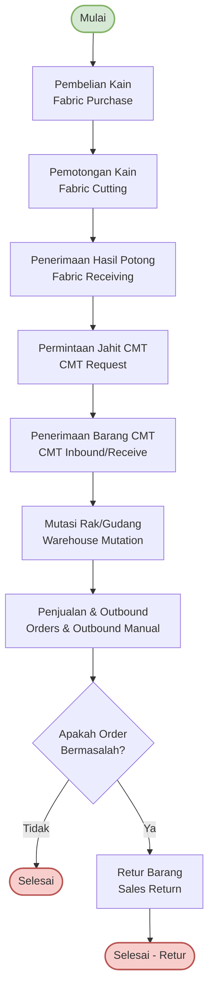

# Alur Bisnis Umum (General Business Flow)

Dokumen ini menjelaskan alur bisnis umum yang didekodekan dari file diagram [`general-business-flow.xml`](file:///c:/Projects/PS%20Ko%20Aci/Apps/ps-frontend/documentations/flow/general-business-flow.xml).

---

## Diagram Alur (Mermaid Diagram)

---

## Deskripsi Paragraf Alur Bisnis

Proses bisnis dimulai dari tahap **Pembelian Kain (Fabric Purchase)**, di mana bahan baku utama berupa kain dipesan dan diterima dari pemasok. Setelah kain tersedia, proses berlanjut ke tahap **Pemotongan Kain (Fabric Cutting)** untuk memotong bahan sesuai dengan pola pakaian yang direncanakan. Hasil dari pemotongan tersebut kemudian dicatat dan divalidasi pada tahap **Penerimaan Hasil Potong (Fabric Receiving)**.

Setelah potongan kain siap dan divalidasi, sistem atau tim akan mengajukan **Permintaan Jahit CMT (CMT Request)** ke pihak konveksi/penjahit (Cut-Make-Trim). Ketika proses penjahitan selesai, barang jadi dikirimkan kembali dan dicatat melalui proses **Penerimaan Barang CMT (CMT Inbound/Receive)**. Pakaian jadi yang diterima ini kemudian disimpan dan diatur posisinya di dalam penyimpanan melalui proses **Mutasi Rak/Gudang (Warehouse Mutation)** untuk memastikan manajemen stok yang rapi.

Tahap berikutnya adalah **Penjualan & Outbound (Orders & Outbound Manual)**, di mana pesanan diproses dan barang dikeluarkan dari gudang untuk dikirimkan ke pelanggan. Setelah pengiriman, dilakukan pengecekan kondisi pesanan:
1. Jika **order tidak bermasalah**, maka proses transaksi dianggap selesai secara sukses (**Selesai**).
2. Jika **order bermasalah** (misal: barang cacat, salah ukuran, atau tidak sesuai pesanan), alur akan dialihkan ke proses **Retur Barang (Sales Return)** sebelum akhirnya transaksi diselesaikan dengan status retur (**Selesai - Retur**).
