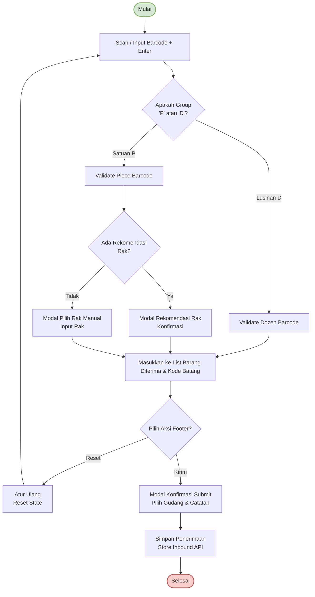

# Alur Inbound (Barang Masuk)

Dokumen ini menjelaskan alur bisnis dan teknikal proses **Inbound (Barang Masuk)** yang didekodekan dari file diagram [`inbound.xml`](file:///c:/Projects/PS%20Ko%20Aci/Apps/ps-frontend/documentations/flow/inbound.xml).

---

## Diagram Alur (Mermaid Diagram)

---

## Deskripsi Paragraf Alur Inbound

Proses inbound atau penerimaan barang jadi dari CMT dimulai ketika pengguna melakukan **Scan atau Input Barcode** pada halaman penerimaan dan menekan tombol *Enter*. Sistem kemudian membagi string barcode untuk mendeteksi identitas kelompok barang melalui kondisi **Apakah Group 'P' (Piece/Satuan) atau 'D' (Dozen/Lusin)**. 

1. **Untuk Barcode Lusinan (Group 'D')**: Sistem akan menjalankan **Validate Dozen Barcode** dengan mengirimkan request ke server. Setelah server memverifikasi kecocokan data beserta rak rekomendasi bawaan, data barang tersebut otomatis langsung dimasukkan ke dalam daftar **Barang Diterima & Kode Batang**.
2. **Untuk Barcode Satuan (Group 'P')**: Sistem akan menjalankan **Validate Piece Barcode** terlebih dahulu, kemudian memeriksa **Apakah Ada Rekomendasi Rak** dari server:
   - Jika **Ada Rekomendasi Rak**, sistem menampilkan **Modal Rekomendasi Rak** untuk meminta konfirmasi pengguna. Setelah disetujui, data dimasukkan ke dalam daftar.
   - Jika **Tidak Ada Rekomendasi Rak**, sistem memunculkan **Modal Pilih Rak Manual** agar pengguna dapat menentukan sendiri rak penyimpanan yang sesuai sebelum data dimasukkan ke dalam daftar.

Setelah seluruh barang yang datang berhasil dipindai dan masuk ke dalam daftar tabel, pengguna dapat menentukan pilihan akhir pada menu footer (**Pilih Aksi Footer**):
- Pilihan **Atur Ulang (Reset State)** akan membersihkan seluruh tabel daftar scan dan mengembalikan pengguna ke tahap awal pemindaian.
- Pilihan **Kirim** akan menampilkan **Modal Konfirmasi Submit** di mana pengguna dapat mengisi catatan tambahan serta memilih gudang penyimpanan tujuan (apabila terdapat barang bertipe lusin). Setelah menekan konfirmasi kirim, sistem memicu request **Store Inbound API** ke backend untuk menyimpan seluruh transaksi penerimaan barang dan menyelesaikan alur inbound (**Selesai**).
