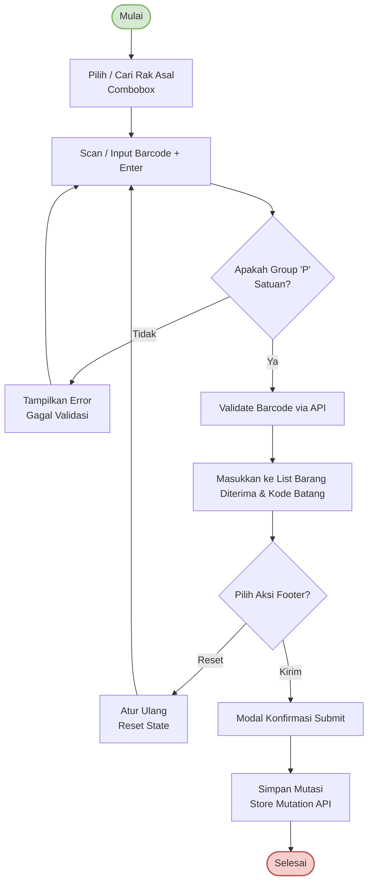

# Alur Mutasi Barang (Warehouse Mutation)

Dokumen ini menjelaskan alur bisnis dan teknikal proses **Mutasi Barang (Warehouse Mutation)** yang didekodekan dari file diagram [`mutation.xml`](file:///c:/Projects/PS%20Ko%20Aci/Apps/ps-frontend/documentations/flow/mutation.xml).

---

## Diagram Alur (Mermaid Diagram)

---

## Deskripsi Paragraf Alur Mutasi Barang

Proses mutasi barang (pemindahan barang dari satu rak/gudang ke lokasi lain) dirancang khusus untuk barang satuan (Piece). Alur dimulai dengan **Pilih/Cari Rak Asal** menggunakan komponen *Combobox*. Pengguna harus terlebih dahulu menentukan rak asal agar kolom input barcode dapat diaktifkan. 

Setelah rak tujuan dipilih, pengguna dapat melakukan **Scan atau Input Barcode** barang satuan dan menekan *Enter*. Sistem kemudian memverifikasi format barcode tersebut:
1. **Pengecekan Tipe Group**: Melalui validasi **Apakah Group 'P' (Satuan)**. Jika barcode yang dimasukkan bertipe lusin (Group 'D') atau tidak memiliki format barcode yang valid, sistem akan **Tampilkan Error (Gagal Validasi)** dan meminta pengguna mengulang scan dengan barcode satuan yang valid.
2. **Validasi Server**: Apabila barcode bertipe satuan ('P') dan belum ada di daftar, sistem memanggil API **Validate Barcode via API** ke backend untuk memastikan keabsahan data barang.

Data barang yang valid otomatis dimasukkan ke dalam daftar **Barang Diterima & Kode Batang** di dalam antarmuka tab. Setelah memindai seluruh barang, pengguna memiliki dua opsi pada footer:
- Opsi **Atur Ulang (Reset State)** untuk menghapus seluruh daftar scan dan kembali ke tahap pemindaian.
- Opsi **Kirim** yang akan menampilkan **Modal Konfirmasi Submit**. Setelah dikonfirmasi, sistem memicu request **Store Mutation API** untuk menyimpan transaksi pemindahan barang ke dalam database dan menyelesaikan alur mutasi (**Selesai**).
