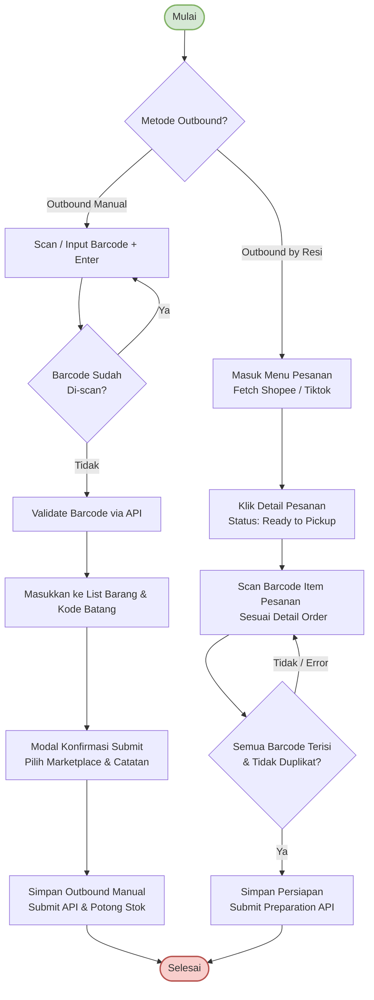

# Alur Outbound Barang (Outbound Manual & Outbound by Resi)

Dokumen ini menjelaskan alur bisnis dan teknikal proses **Outbound Barang (Outbound Manual & Outbound by Resi)** yang didekodekan dari file diagram [`outbound.xml`](file:///c:/Projects/PS%20Ko%20Aci/Apps/ps-frontend/documentations/flow/outbound.xml).

---

## Diagram Alur (Mermaid Diagram)

---

## Deskripsi Paragraf Alur Outbound Barang

Proses outbound (pengeluaran barang jadi dari gudang) dapat diproses melalui dua metode utama berdasarkan keputusan **Metode Outbound**:

### 1. Metode Outbound Manual
- Digunakan untuk pengeluaran stok mandiri/manual. Pengguna langsung melakukan **Scan/Input Barcode** satuan.
- Sistem mengecek secara lokal jika **Barcode Sudah Di-scan?** (untuk mencegah duplikasi). Jika ya, scan diabaikan dan dibersihkan. Jika tidak, sistem mengirim request ke server untuk **Validate Barcode via API**.
- Setelah divalidasi dan detail item diperoleh, data **Dimasukkan ke List** (tab *Barang Keluar* dan *Kode Batang*).
- Setelah selesai, pengguna mengonfirmasi via **Modal Konfirmasi Submit** untuk menentukan **Marketplace tujuan** (Shopee, Tiktok Shop, atau manual/tanpa marketplace) dan menambahkan **Catatan**.
- Setelah disubmit, API akan memproses **Simpan Outbound Manual** dan secara otomatis memotong stok barang satuan di lokasi rak terkait (**Selesai**).

### 2. Metode Outbound by Resi (Menu Pesanan)
- Digunakan untuk memproses pesanan masuk dari marketplace terintegrasi. Pengguna masuk ke **Menu Pesanan** dan dapat melakukan sinkronisasi pesanan secara manual (*Fetch Shopee Manual* atau *Fetch Tiktok Manual*).
- Pengguna memilih pesanan dengan status `Ready to Pickup` (atau `Ready to Ship`) dan masuk ke halaman **Detail Pesanan**.
- Pengguna melakukan **Scan Barcode Item Pesanan** secara spesifik untuk mencocokkan fisik barang dengan rincian pesanan.
- Setelah pemindaian, sistem memverifikasi **Apakah Semua Barcode Terisi & Tidak Duplikat?**. Jika terdapat error atau barcode kosong/duplikat, pengguna diminta untuk memperbaikinya.
- Jika verifikasi lolos, pengguna menekan tombol simpan untuk mengeksekusi **Simpan Persiapan (Submit Preparation API)**, yang akan mencatat barcode barang yang keluar untuk pesanan tersebut dan memperbarui status pesanan menjadi siap kirim (**Selesai**).
